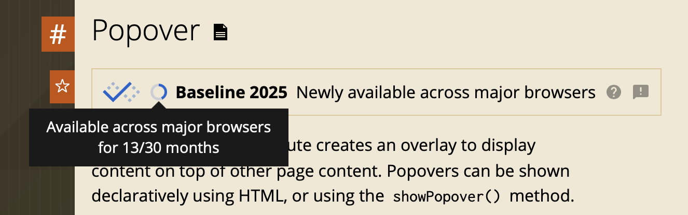

# Interactive functionality

## Browsers en Feature detection 

In Sprint 3 heb je geleerd dat er veel verschillende mensen zijn, en waarom je dus rekening moet houden met _Toegankelijkheid_. In deze sprint leer je dat er ook veel verschillende browsers zijn, en hoe je daar rekening mee kunt houden tijdens het ontwerpen en coderen.

### Aanpak

Deze sprint hebben we ons wat meer verdiept in _Progressive Enhancement_; een coding strategie waarmee je er voor kunt zorgen dat zoveel mogelijk mensen jouw werk kunnen gebruiken. Vandaag gaan we meer leren over _Baseline CSS_ en _feature detection_ en dit toepassen op de leertaak. Komende vrijdag krijg je hierop een code review.

## Browsers en engines

<!-- 

>>> Stukje toevoegen over browsers en browser engines. En een heel klein stukje geschiedenis van de browser ... en dat plaatje van wikipedia met al die browsers <<<

-->

In het college van vandaag kwamen onderstaande bronnen langs.

- [Rendering Engine @ MDN](https://developer.mozilla.org/en-US/docs/Glossary/Engine/Rendering)
- [How browser rendering works – behind the scenes](https://blog.logrocket.com/how-browser-rendering-works-behind-scenes/)
- [Timeline of Web Browsers](https://upload.wikimedia.org/wikipedia/commons/7/74/Timeline_of_web_browsers.svg)
- [WorldWideWeb Rebuild](https://worldwideweb.cern.ch/)
- [Lynx](https://lynx.browser.org/)
- [BrowserStack for GitHub Students](https://www.browserstack.com/github-students)

## Baseline

Progressive Enhancement is een coding strategie, waarbij je je website opbouwt in lagen. Zo zorg je ervoor dat als iets stuk gaat, of als een browser een techniek niet ondersteund, je website terugvalt naar een laag die wel werkt:

1) Bouw de functionaliteit robuust, met de simpelste techniek​ in HTML en met Server-Side Rendering​
2) Voeg Baseline CSS voor de huisstijl toe​
3) Enhance de functionaliteit _geleidelijk_ voor een betere User Experience

Voor stap 2 moet je (altijd) onderzoeken welke Baseline CSS je nodig hebt om je website te stylen in de huisstijl. ​

### Web Platform Baseline

Met de _Web Platform Baseline_ kan je bepalen hoe je technieken kan gebruiken voor je website. Op [caniuse.com](https://caniuse.com/wf-popover) kan je bekijken wat de baseline van een technische feature is. Bijvoorbeeld het HTML `popover` element is sinds 2025 in de fase _Baseline Newly_, het wordt nu 13 maanden ondersteund in de grote browsers ... 
 

Baseline bestaat uit 3 fases: 

#### Limited
Als een techniek nieuw is en nog niet door veel browser wordt ondersteund. Je kan de techniek als _enhancement_ gebruiken voor je website. Het zou kunnen de techniek en hoe de browsers het implementeren nog gaat veranderen.

#### Newly
Een technische feature wordt ondersteund door de grote browsers Chrome, Edge, Safari and Firefox. Je kan de techniek als _enhancement_ gebruiken voor je website.

#### Widely
Als een feature meer dan 30 maanden wordt ondersteund door de grote browsers kan je de techniek veilig gebruiken.

#### Bronnen
[What is Baseline?](https://web-platform-dx.github.io/web-features/)

### Opdracht 

<!--

>>> Hoe maak je een baseline.css? 
Ook iets doen met comments, dates en acceptatiecriteria?
En in de opdracht voor de leertaak de Baseline uitelggen? <<<

-->

## Feature detection

Als je je website in robuust hebt opgezet in HTML en Server-Side Rendering, en je hebt je ​Baseline CSS goed staan, kan je je code _geleidelijk_ uitbreiden voor een betere User Experience. Deze 3e stap noemen we _enhancen_. 

Je wil natuurlijk een website die goede feedback geeft met subtiele animaties en prettige interacties. Alleen kunnen niet alle browser dit laten zien. Daarom kun je in de 3e laag _feature detection_ gebruiken om te checken of een browser een bepaalde CSS of JS techniek kan uitvoeren. Als dit niet zo is, dan valt de website terug naar een laag die het wel goed doet. Misschien niet zo mooi, fancy en flitsend, maar het werkt wel ... 

### Strategieën

Er zijn verschillende strategieën voor feature detection:

- De Cascade
- Feature detection in CSS: @supports
- Media Queries in CSS: @media
- Feature detection in JS
- Verberg UI waar je JS voor nodig hebt, en toon deze met JS
- Gebruik binnen HTML zelf Progressive Enhancement
- Polyfills

<!--
Feature detection (kort) uitleggen. In relatie tot 'enhancements' .. 
In de deeltaak staan verschillende strategieen. 

Even uitleggen hoe feature detection werk in HTML, in CSS en in JS. 
HTML slaat over.
CSS negeert.
JS stopt.

Er zijn verschillende strategiën
Voorbeelden voor verschillende enhancements in kleine opdrachtjes laten doen, en testen op de verschillende browsers
Voorbeeld @support demo op kopo-github/PE

In de workshop gaan we kleine opdrachtjes doen om hier mee te oefenen.

We gaan nu oefenen met een paar moderen CSS technieken die het niet in alle browsers doen, maar nog in experimental flag safari, chrome, firefox zitten ... (wat betekent dat nou weer?) 

masonry in Safari TP
https://developer.mozilla.org/en-US/docs/Web/CSS/CSS_grid_layout/Masonry_layout

cross document view transitions in safari TP
https://webkit.org/blog/15978/release-notes-for-safari-technology-preview-204/

styling details
https://developer.chrome.com/blog/styling-details

attr() https://developer.chrome.com/blog/chrome-133-beta
scroll-state() https://bsky.app/profile/nerdy.dev/post/3lfslpmu6f226
Scroll-State Queries & Anchor https://css-carousel-gallery.netlify.app/horizontal/list

-->

#### Bronnen

Om meer te leren over wat mogelijk is met feature detection kan je deze bronnen lezen: 
- [Implementing feature detection @ MDN](https://developer.mozilla.org/en-US/docs/Learn_web_development/Extensions/Testing/Feature_detection)
- [@supports in CSS @ MDN](https://developer.mozilla.org/en-US/docs/Web/CSS/@supports)

### Browser features
Op MDN kun je van elke browser feature ook zien hoe de ondersteuning is. Hiermee kun je inschatten wat je strategie voor Progressive Enhancement moet worden, en hoe je je werk kunt testen

_Op MDN staat welke browsers een bepaalde techniek ondersteunen._

## Opdracht
💪 In JavaScript kun je ook een aantal patronen gebruiken om _feature detection_ toe te passen. Vooral in sprint 10 gaan we hiermee aan de gang, maar mocht je al _client-side_ JavaScript gebruiken, onderzoek dan ook deze patronen met onderstaande bronnen.

👉 Pas feature detection toe op de opdracht uit de leertaak. Installeer zoveel mogelijk browsers waarmee je kunt testen. Test je werk met (oudere) browsers die andere features ondersteunen, zoals Lynx en apparaten uit het device lab. Probeer BrowserStack uit met een GitHub student account. Maak issues van je bevindingen, en onderzoek oplossingen. En los deze ook op. Misschien moet je je core functionaliteit wel opnieuw uitschetsen hiervoor? Misschien moet je wel een extra stap (terug) maken in je HTML?

#### Bronnen

- [Feature detection in JavaScript @ MDN](https://developer.mozilla.org/en-US/docs/Learn_web_development/Extensions/Testing/Feature_detection#javascript)
- [Progressive Enhancement @ MDN](https://developer.mozilla.org/en-US/docs/Glossary/Progressive_Enhancement)
- [Progressive Enhancement Resources](https://github.com/voorhoede/progressive-enhancement-resources)
- [Can I Use...](https://caniuse.com/)
