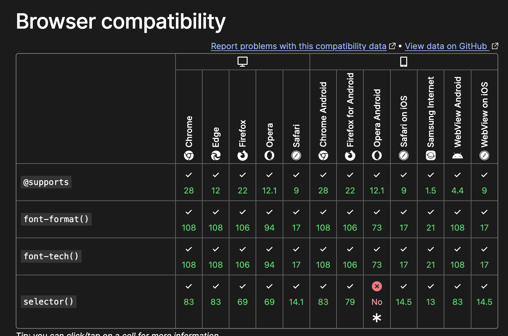

# Interactive functionality

## Browsers en Feature detection 

In Sprint 3 heb je geleerd dat er veel verschillende mensen zijn, en waarom je dus rekening moet houden met _Toegankelijkheid_. In deze sprint leer je dat er ook veel verschillende browsers zijn, en hoe je daar rekening mee kunt houden tijdens het ontwerpen en coderen.


### Aanpak

Afgelopen maandag hebben we ons wat meer verdiept in _Progressive Enhancement_; een coding strategie waarmee je er voor kunt zorgen dat zoveel mogelijk mensen jouw werk kunnen gebruiken. Vandaag gaan we meer leren over _Baseline CSS_ en _feature detection_ en dit toepassen op de leertaak. Komende vrijdag krijg je hierop een code review.


## Browsers en engines

In het college van vanochtend kwamen onderstaande bronnen langs.

- [Rendering Engine @ MDN](https://developer.mozilla.org/en-US/docs/Glossary/Engine/Rendering)
- [How browser rendering works – behind the scenes](https://blog.logrocket.com/how-browser-rendering-works-behind-scenes/)
- [Timeline of Web Browsers](https://upload.wikimedia.org/wikipedia/commons/7/74/Timeline_of_web_browsers.svg)
- [WorldWideWeb Rebuild](https://worldwideweb.cern.ch/)
- [Lynx](https://lynx.browser.org/)
- [BrowserStack for GitHub Students](https://www.browserstack.com/github-students)


## Baseline CSS

Progressive Enhancement is een coding strategie, waarbij je je website opbouwt in lagen. Zo zorg je ervoor dat als iets stuk gaat, of als een browser een techniek niet ondersteund, je website terugvalt naar een laag die wel werkt:

1) Bouw de functionaliteit robuust, met de simpelste techniek​ in HTML en met Server-Side Rendering​
2) Voeg Baseline CSS voor de huisstijl toe​
3) Enhance de functionaliteit _geleidelijk_ voor een betere User Experience​

### Baseline?
https://web.dev/baseline


Baseline has two stages:
Newly available: The feature is supported by all of the core browsers, and is therefore interoperable.
Widely available: 30 months have passed since the newly interoperable date. The feature can be used by most sites without worrying about support.
Prior to being Newly available, a feature has Limited availability when it's not yet supported across browsers.


Duidelijk, industry standard, bestaande onderzoeken, iets minder arbitrair dan “wat op ons shitty device lab werkt”, past zich door de tijd aan (houdbaar), komt veel terug in artikelen en caniuse. Enige nadeel dat het Google branded is (en dat baseline zelf (nog) geen rekening houdt met polyfills, toegankelijkheid, backwards compatibility, bugs, dus dat de werkelijkheid iets complexer is..)
 
https://basewatch.dev

BaseWatch — Get Notified When CSS Features Reach Baseline
Track CSS, JS & HTML browser support. Get email alerts when features hit your chosen support threshold. Free, no account needed.

 
<!--

We kunnen ook best promoten dat je in stap 2 super basic CSS schrijf die het altijd doet
2. Voeg Mobile First CSS voor de huisstijl toe
En pas daarna custom-properties, nesting, bla bla bla, in stap 3 = enhancements.
Desnoods een los CSS file als eerste inladen, dan maak je gebruik van de Cascade, super basic old skool CSS als een soort reset, nee geen reset maar een .. ander woord voor verzinnen.
2. Voeg Basic CSS voor de huisstijl toe die het altijd doet
Als onderdeel van de PE strategie

<head>
    ...
    <link rel="stylesheet" href="base.css">
    <link rel="stylesheet" href="style.css"> nesting. custom props, alles gebruiken maar wel met feature detection
</head>
KH: Dat is je one column layout toch?
KR: Ja maar meer dan dat. CSS die het altijd doet. Als we daar bekende termen schrijven kan het ook weer verwarrend zijn. Ik weet niet wat voor CSS ze voor de one column gebruiken, ik denk met custom props …
KH: Geen enkele css doet het ‘altijd’.
KH: Huisstijl op een Kindle wordt al moeilijk.
KH: Elke regel css is een enhancement
KR: We kunnen ze leren dat ze (altijd) een basic css maken met old skool technieken, en daarna nieuwe technieken als enhancements toepassen. En daar over nadenken. En er achter komen dat zelfs stap 2 al een enhancement is. En stap 1 ook niet op elke browser hetzelfde. En wat er gebeurt met popup in een crappy browser. En dat de switch input ook niet maar terugvalt naar een standaard input. En … en …
KR: Het gaat mij nu over het poneren van de term ‘basic’ zodat we ze kunnen leren, en niet afleren, custom props te gebruiken en nesting, maar dat dat stap 3 is?
KR: En dan liever niet dezelfde termen gebruiken, want dan denken studenten dat ze dat al goed doen. Omdat ze dat al hebben geleerd. Goed plan?
KH: Dan moeten we ze weer zoveel afleren over styleguides opzetten enzo, wat ze nu met custom props doen
KH: Veel liever dat ze nu nog een stap maken met nog net iets langer over HTML nadenken
KH: Die tweede stap is niet houdbaar in het echt
KH: Door alle framework shit die ze straks gaan doen
KR: Maar dan creëren we juist de goede vragen. Juist ook in frameworks. Hey geen basic css? Nee compile . Werkt dat dan? Mwuah soms, vaak, eigenlijk niet, niet goed genoeg, …
KH: Ik ben vooral bang dat als we ze nu iets nieuws aanleren ze geen van beide goed gaan doen

-->


## Feature detection

Als je je website in robuust hebt opgezet in HTML en Server-Side Rendering, en je hebt je ​Baseline CSS goed staan, kan je je code _geleidelijk_ uitbreiden voor een betere User Experience. Deze 3e stap noemen we _enhancen_. 

Je wil natuurlijk een website die goede feedback geeft met subtiele animaties en prettige interacties. Alleen kunnen niet alle browser dit laten zien. Daarom kun je in de 3e laag _feature detection_ gebruiken om te checken of een browser een bepaalde CSS of JS techniek kan uitvoeren. Als dit niet zo is, dan valt de website terug naar een laag die het wel goed doet. Misschien niet zo mooi, fancy en flitsend, maar het werkt wel ... 

<!--
We gaan nu oefenen met een paar moderen CSS technieken die het niet in alle browsers doen, maar nog in experimental flag safari, chrome, firefox zitten ... (wat betekent dat nou weer?) 

masonry in Safari TP
https://developer.mozilla.org/en-US/docs/Web/CSS/CSS_grid_layout/Masonry_layout

cross document view transitions in safari TP
https://webkit.org/blog/15978/release-notes-for-safari-technology-preview-204/

styling details
https://developer.chrome.com/blog/styling-details

attr() https://developer.chrome.com/blog/chrome-133-beta
scroll-state() https://bsky.app/profile/nerdy.dev/post/3lfslpmu6f226
Scroll-State Queries & Anchor https://css-carousel-gallery.netlify.app/horizontal/list


-->


### @support in CSS
In CSS kun je voor feature detection `@supports` gebruiken.

Bijvoorbeeld als je een nieuwe techniek `background-clip: text` wil gebruiken, dan kun je met `@support` checken of een browser dit ondersteunt. Zo kan je ervoor zorgen dat de website niet stuk gaat als een browser dit niet ondersteund. Want als je in onderstaand voorbeeld geen feature detection zou toepassen dan kan het gebeuren dat de tekst niet te lezen is.

```css
h1 {
	color: #050542;

	@supports (background-clip: text) {
		background: linear-gradient(to right, #A675F5, #050542);
		background-clip: text;
		color: transparent;
	}
}
```

Zo kun je ook controleren of een bepaalde selector ondersteund wordt:

```css
@supports selector(:has(a)) {
	...
}
```

Of je kunt controleren of custom properties ondersteund worden:

```css
@supports (--custom: properties) {
	...
}
```

### CSS Cascade 
in veel gevallen heb je geen feature detection nodig, vanwege [de _Cascade_ in CSS](https://developer.mozilla.org/en-US/docs/Learn_web_development/Core/Styling_basics/Handling_conflicts#cascade). Door slim gebruik te maken van de _cascade_ zorg je ervoor dat je code simpeler wordt en dat je website niet stuk gaat. Een browser negeert CSS die niet kan worden uitgevoerd en zal zo'n regel dus 'gewoon' overslaan. Wanneer je iets kan oplossen met de cascade doe dit dan!

```css
h1 {
	color: #ff0000;
	color: color(display-p3 1 0.08 0); /* super red! */;
}
```
Bijvoorbeeld: Bepaal eerst de kleur in hex en daarna met de `color()` function en het nieuwe kleurenchema `display-P3`. Als een browser dit niet kent zal het die regel negeren, maar is de kleur wel rood. Kan een browser het wel uitvoeren? Dan is de kleur super rood!


#### Bronnen

Om meer te leren over wat mogelijk is met feature detection kan je deze bronnen lezen: 
- [Implementing feature detection @ MDN](https://developer.mozilla.org/en-US/docs/Learn_web_development/Extensions/Testing/Feature_detection)
- [@supports in CSS @ MDN](https://developer.mozilla.org/en-US/docs/Web/CSS/@supports)


### Browser features
Op MDN kun je van elke browser feature ook zien hoe de ondersteuning is. Hiermee kun je inschatten wat je strategie voor Progressive Enhancement moet worden, en hoe je je werk kunt testen


_Op MDN staat welke browsers een bepaalde techniek ondersteunen._


## Opdracht
💪 In JavaScript kun je ook een aantal patronen gebruiken om _feature detection_ toe te passen. Vooral in sprint 10 gaan we hiermee aan de gang, maar mocht je al _client-side_ JavaScript gebruiken, onderzoek dan ook deze patronen met onderstaande bronnen.

👉 Pas feature detection toe op de opdracht uit de leertaak. Installeer zoveel mogelijk browsers waarmee je kunt testen. Test je werk met (oudere) browsers die andere features ondersteunen, zoals Lynx en apparaten uit het device lab. Probeer BrowserStack uit met een GitHub student account. Maak issues van je bevindingen, en onderzoek oplossingen. En los deze ook op. Misschien moet je je core functionaliteit wel opnieuw uitschetsen hiervoor? Misschien moet je wel een extra stap (terug) maken in je HTML?


### Bronnen

- [Feature detection in JavaScript @ MDN](https://developer.mozilla.org/en-US/docs/Learn_web_development/Extensions/Testing/Feature_detection#javascript)
- [Progressive Enhancement @ MDN](https://developer.mozilla.org/en-US/docs/Glossary/Progressive_Enhancement)
- [Progressive Enhancement Resources](https://github.com/voorhoede/progressive-enhancement-resources)
- [Can I Use...](https://caniuse.com/)
