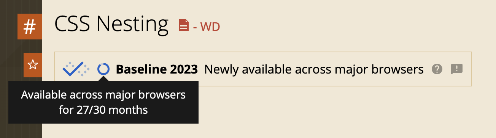

# Interactive functionality

## Browsers en Feature detection

In Sprint 3 heb je geleerd dat er veel verschillende mensen zijn, en waarom je dus rekening moet houden met _Toegankelijkheid_. In deze sprint leer je dat er ook veel verschillende browsers zijn, en hoe je daar rekening mee kunt houden tijdens het ontwerpen en coderen.

### Aanpak

Deze sprint hebben we ons werdiept in _Progressive Enhancement_; een coding strategie waarmee je er voor kunt zorgen dat zoveel mogelijk mensen jouw website kunnen gebruiken. Vandaag gaan we meer leren over _Baseline CSS_ en _feature detection_ en dit toepassen op de leertaak. Komende vrijdag krijg je hierop een code review.

## Browsers en engines

<!-- 

>>> Stukje toevoegen over browsers en browser engines? En een heel klein stukje geschiedenis van de browser ... en dat plaatje van wikipedia met al die browsers <<<

-->

In het college van vandaag over Browsers kwamen onderstaande bronnen langs.

- [Rendering Engine @ MDN](https://developer.mozilla.org/en-US/docs/Glossary/Engine/Rendering)
- [How browser rendering works – behind the scenes](https://blog.logrocket.com/how-browser-rendering-works-behind-scenes/)
- [Timeline of Web Browsers](https://upload.wikimedia.org/wikipedia/commons/7/74/Timeline_of_web_browsers.svg)
- [WorldWideWeb Rebuild](https://worldwideweb.cern.ch/)
- [Lynx](https://lynx.browser.org/)
- [BrowserStack for GitHub Students](https://www.browserstack.com/github-students)

## Baseline

Als je je website ontwerpt en bouwt volgens het principe van Progressive Enhancement zorg je ervoor dat als iets stuk gaat, of als een browser een techniek niet ondersteunt, je website terugvalt naar een laag die wel werkt:

1) Bouw de functionaliteit robuust, met de simpelste techniek​ in HTML en met Server-Side Rendering​
2) Voeg Baseline CSS voor de huisstijl toe​
3) Enhance de functionaliteit _geleidelijk_ voor een betere User Experience

Bovenop de laag met HTML en Server-Side rendering voeg je de Baseline CSS toe voor de huisstijl. Daarna ga je features toevoegen als enhancements. De Baseline CSS bestaat uit CSS die door alle grote browsers goed wordt ondersteund.

### Web Platform Baseline

Met de _Web Platform Baseline_ kan je bepalen hoe je technieken kan gebruiken voor je website. Op [caniuse.com](https://caniuse.com/?search=Nesting) kan je bekijken wat de Baseline van een technische feature is.

Bijvoorbeeld CSS `nesting` is sinds 2023 in de fase _Baseline Newly_, het wordt nu 27 maanden ondersteund in alle grote browsers ... nog 3 maanden en je kan dit veilig gebruiken in produktie:

<!-- Bijvoorbeeld het HTML `popover` element is sinds 2025 in de fase _Baseline Newly_, het wordt nu 13 maanden ondersteund in de grote browsers ... nog 17 maanden en je kan dit veilig gebruiken:
  -->

### Baseline bestaat uit 3 fases: 

#### Limited Availability
Als een techniek nieuw is en nog niet door veel browser wordt ondersteund. Je kan de techniek als _enhancement_ gebruiken voor je website. Het zou kunnen dat de techniek en hoe de browsers het implementeren nog gaat veranderen.

#### Newly Available
Een technische feature wordt ondersteund door de grote browsers Chrome, Edge, Safari and Firefox. Je kan de techniek als _enhancement_ gebruiken voor je website.

#### Widely Available
Als een feature meer dan 30 maanden wordt ondersteund door de grote browsers kan je de techniek veilig gebruiken.

#### Bronnen
- [What is Baseline?](https://web-platform-dx.github.io/web-features/)
- [How to use Baseline](https://web.dev/how-to-use-baseline)

### Opdracht Baseline CSS

Je hebt in semster 1 al geleerd om te beginnen met een HTML prototype en daarna een _One Column Layout_ te bouwen in de huisstijl, met de styling voor de kleuren, typografie en formulier elementen.

Om ervoor te zorgen dat zoveel mogelijk browsers de huisstijl goed laten zien moet je ervoor zorgen dat deze CSS voldoet aan _Baseline Widely Available_.

Onderzoek of de elementen in jouw stylesheet voor de huisstijl voldoen aan de Baseline. Denk bijvoorbeeld aan kleuren, font-sizes, borders, breedtes en/of hoogtes van elementen, formulier elementen en interactieve elementen met link-related pseudo-classes (`:hover`, `:link`, `:visited`, `:active`, `:focus`). Hoe zit het met het gebruik van _Custom Properties_? En kan je _Nesting_ al veilig gebruiken? 

Voldoet een _selector_, _property_, _value_, _unit_ of ander onderdeel van de CSS niet aan de _Basline Widely_? Maak dan een issue aan om later te onderzoeken hoe je dit beter kan maken.

## Feature detection

Als je je website robuust hebt opgezet in HTML en Server-Side Rendering, en je hebt je ​Baseline CSS goed staan voor de huisstijl, kan je je code _geleidelijk_ uitbreiden voor een betere User Experience. Deze 3e stap noemen we _enhancen_.

Je wil natuurlijk een website die goede feedback geeft met subtiele animaties en prettige interacties. Alleen kunnen niet alle browser dit laten zien. Daarom kun je in de 3e laag _feature detection_ gebruiken om te checken of een browser een bepaalde CSS of JS techniek kan uitvoeren. Als dit niet zo is, dan valt de website terug naar een laag die het wel goed doet. Misschien niet zo mooi, fancy en flitsend, maar het werkt wel ... 

### Strategieën

Er zijn verschillende strategieën voor _feature detection_. 

- CSS Cascade
- Feature detection in CSS: @supports
- Media Queries in CSS: @media
- Feature detection in JS
- Verberg UI waar je JS voor nodig hebt, en toon deze met JS
- Gebruik binnen HTML zelf Progressive Enhancement
- Polyfills

Deze strategieën zijn uitgelegd in de deeltaak over [Progressive Enhancement](https://github.com/fdnd-task/progressive-enhancement/)

#### Verschil HTML, CSS, JS
Het is belangrijk om te begrijpen dat browsers anders omgaan met HTML, CSS en JS. 

Als een HTML element niet wordt herkend door een browser zal standaard een `
` worden gerenderd.

Als een browser CSS niet ondersteunt zal dit worden genegeerd. (Daarom is de Cascade ook zo'n goede strategie om toe te passen als je moderne CSS technieken wil gebruiken)

Als een browser JS niet ondersteunt of er zit een bug in de code, krijg je een error en stopt het script. Dit betekent dat code onder de error niet wordt uitgevoerd. (Als je dan de HTML goed hebt staan, valt de website automatisch terug naar de laag die het wel goed doet!)

### Opdracht Feature Detection

Onderzoek met je tafel onderstaande moderne CSS technieken. Bouw een demo in je Learning Journal en test deze op de browsers die jullie op het whiteboard hebben geschreven. Schrijf een ✅ achter de browser die een feature ondersteunt, schrijf een ❌ als een browser de feature niet ondersteunt. 

💪 Probeer de CSS als enhancement te coderen met behulp van een van de Feature detection strategieën.

Verdeel deze CSS technieken met je tafel, zorg ervoor dat jullie alle technieken hebben uitgeprobeerd en getest:

- Attr() CSS function 
- Scroll-State Container Queries
- Anchor Positioning
- View Transitions
- Styling Details
- Masonry layout
- Scroll-button() CSS pseudo-element

<!--
masonry in Safari TP
https://developer.mozilla.org/en-US/docs/Web/CSS/CSS_grid_layout/Masonry_layout

Cross document view transitions in safari TP
https://webkit.org/blog/15978/release-notes-for-safari-technology-preview-204/

Styling details
https://developer.chrome.com/blog/styling-details

attr() https://developer.chrome.com/blog/chrome-133-beta

scroll-state() https://bsky.app/profile/nerdy.dev/post/3lfslpmu6f226

Scroll-State Queries & Anchor https://css-carousel-gallery.netlify.app/horizontal/list

-->

#### Bronnen

Om meer te leren over wat mogelijk is met feature detection kan je deze bronnen lezen: 
- [Implementing feature detection @ MDN](https://developer.mozilla.org/en-US/docs/Learn_web_development/Extensions/Testing/Feature_detection)
- [@supports in CSS @ MDN](https://developer.mozilla.org/en-US/docs/Web/CSS/@supports)
- [Feature detection in JavaScript @ MDN](https://developer.mozilla.org/en-US/docs/Learn_web_development/Extensions/Testing/Feature_detection#javascript)
- [Can I Use...](https://caniuse.com/)
