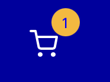
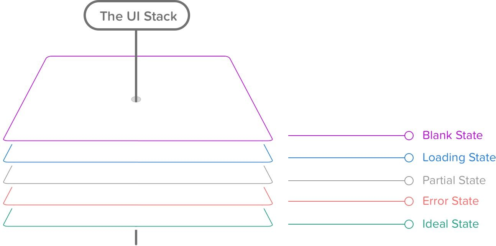
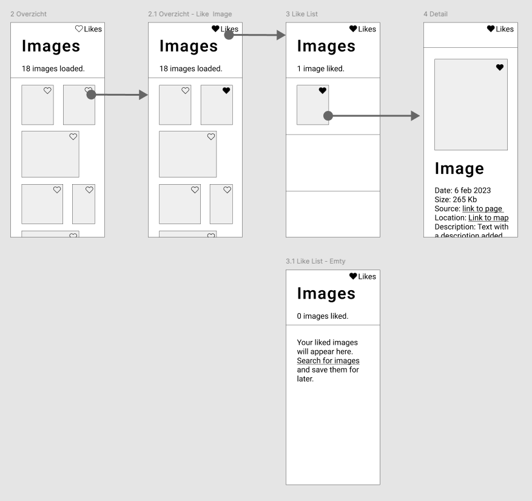

# Interactive functionality

## UI states voor POST interactie

Als je een interactie ontwerpt moet je voor de gebruiker feedback ontwerpen. Je weet dat je met feedback en feedforward ervoor kan zorgen dat gebruikers weten wat ze moeten doen. Dit doe je o.a. met de juiste labels, teksten en button states.  

Omdat we deze sprint met het POSTen van data werken, wordt de _state_ van je website belangrijk. 
De _state_ geeft aan of er al informatie is opgeslagen of nog niet.  
Een goed voorbeedld hiervan is de winkelwagen van bol.com. 

Als een product is toegevoegd kan je dat aan het winkelwagentje zien: 

### Aanpak

Vandaag gaan we eerst onderzoeken wat de UI-stack is. 
Daarna ga je het toepassen op je eigen opdracht. 

Ook gaan we je vorderingen bespreken om te kijken waar je hulp bij nodig hebt.
Hoe ver ben je met de opzet van je opdracht en de POST interactie? Schrijf op het whiteboard je naam en hoe ver je bent met jouw opdracht: 1,2,3,4,5,6:

1. Repo met Server.js, Get routes en views opgezet in je nieuwe repo
2. POST Interactie bedenken en schetsen
3. Interactie ontwerpen met een Wireflow en breakdown
4. Bouw de functionaliteit in HTML en server-side: Routes
5. Bouw de functionaliteit in HTML en server-side: Formulier maken
6. Bouw de functionaliteit in HTML en server-side: Opslaan in Directus
7. ...

## UI-Stack

Voor het ontwerpen van states met dynamische data gebruiken we de UI-Stack. 
In het artikel How to Fix a Bad Interface staat:

> Every screen you interact with in a digital product has multiple personalities.
> 
> [How to fix a bad user interface](https://www.scotthurff.com/posts/why-your-user-interface-is-awkward-youre-ignoring-the-ui-stack/)

Voor elke scherm waar een gebruiker iets mee doet moet je verschillende states tonen. 
Er wordt bijvoorbeeld data geladen, of er kan iets mis gaan. 
Dan heeft de gebruiker feedback nodig die duidelijk maakt wat er gebeurt. 
Hiervoor heeft een scherm soms wel 4-6 states nodig. 

1. Loading State
2. Partial State
3. Error State
4. Ideal state

en 

5. Empty State, als er nog niets is gepost
6. Succes State, als een post is gelukt

 *verschillende states van dezelfde pagina.*

### Opdracht

Onderzoek met je tafel de states van de UI-Stack:

👉 Schrijf de UI-Stack states op het bord

👉 Zoek voor elke state een goed voorbeeld, heb je ook voorbeelden waar het niet goed gaat?

👉 Schrijf kort op waar ze voor gebruikt worden

👉 Bespreek met je tafel welke UI-stack states je kan gebruiken voor jouw `post` interactie

## UI-Stack ontwerpen en bouwen

Als het goed is hebt je al een wireflow van jouw interactie. 
Eigenlijk is dat al de *ideal* state. 
Vandaag ga je je wireflow uitbreiden met andere states van de UI-Stack.

### Wireflow/Screenflow uitbreiden met de UI-Stack

Bespreek je Wireflow over je POST funcionaliteit met je buur en bedenk welke states van de UI-Stack je nodig hebt. 
Wat laat je bijvoorbeeld zien als er nog geen berichten zijn gepost? 
Wat zou er mis kunnen gaan met posten en wat voor feedback geef je dan aan de gebruiker? 
En wat ziet een gebruiker als de POST goed gaat?

Voeg de states toe in Figma en geef ze een duidelijke titel en korte uitleg. 
Omdat dit states zijn van dezelfde pagina teken je ze niet in de flow van de interactie. 
Dat ziet er bijvoorbeeld zo uit: 

 

<!--
👉 Breid je wireflow uit met elke UI state

Welke states kunnen ze nu gaan maken? 
Empty state
Partial state?
Ideal state

Een lijst kan gevuld zijn
Een lijst kan nog leeg zijn, er zit nog niet in
Een lijst kan gedeeltelijk vol zijn, maar nog niet volledig, iemand moet nog iets doen? 

Group aanmaken maar er zijn nog geen users...
Lijst met likes op een foto maar je foto is nog niet gelikt ...

-->

### UI-Stack states bouwen in Liquid

Omdat we server-side pagina's aan het bouwen zijn, gaan we beginnen met het bouwen van een empty-state. 
De loading-state heb je pas nodig als je de POST client-side gaat maken in sprint 10.

Om de empty-state te kunnen tonen in Liquid zul je gebruik moeten maken van _if/else statements_. 
Welke HTML moet gerenderd worden als er geen data is? Welke HTML moet gerenderd worden als er wel data gePOST is? 

👉 Schrijf bij de Wireflows pseudo-code hoe je die state kan bouwen. Kijk in de Liquid documentatie welke tags en filters je zou kunnen gebruiken om een empty state te maken en schrijf ze op het bord

👉 Als je het ontwerp en pseudo-code bedacht hebt, kan je proberen de states te bouwen. Vrijdag gaan we de states testen en/of elkaar helpen met de volgende stap.

💪 Maak de UI states in [partials](https://shopify.github.io/liquid/tags/template/#render)

### Bronnen

- [UI-Stack - How to fix a bad user interface](https://www.scotthurff.com/posts/why-your-user-interface-is-awkward-youre-ignoring-the-ui-stack/)
- [Shopify Liquid documentatie](https://shopify.github.io/liquid/)
- [Officiele Liquid documentatie](https://liquidjs.com/index.html)
