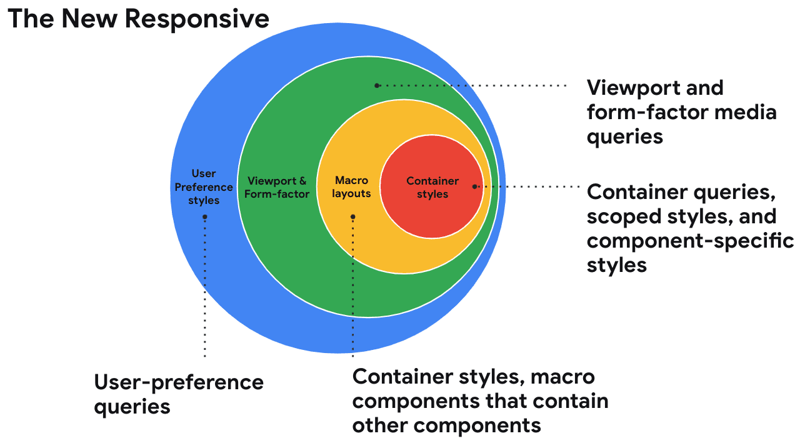
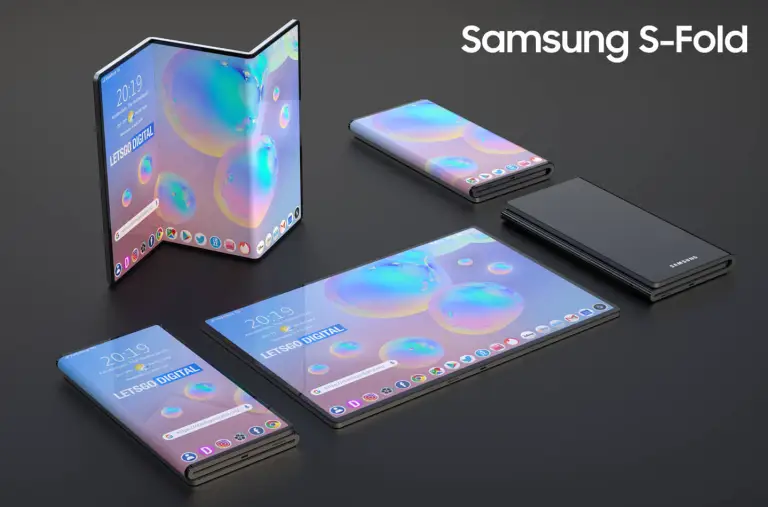

# Interactive functionality

## User Preferences 

Responsive web design <!-- anno 2025 --> is een website die zich aanpast aan de vorm van het apparaat, én waarbij je rekening houdt met gebruikersinstellingen van de user.

Responsive web design is moeilijk. Er bestaan al veel apparaten met verschillende schermen en er komen steeds meer apparaten bij met afwijkende schermformaten. Kleine ronde schermen zoals smart watches, schermen die in- en uitklapbaar zijn (foldables) of die je om je arm kan dragen... wot?

Behalve met schermformaten kan je in CSS ook rekening houden met gebruikersinstellingen zoals light/dark modes, wel of geen animaties of high contrast. Je kan websites maken die zich aanpassen aan de gebruikerinstellingen, de _User Preferences_.


### Aanpak 

Vandaag ga je leren hoe je _media queries_ kan gebruiken om rekening te houden met gebruikersinstellingen en gaan we design ideeën bedenken voor opvouwbare schermen. 

<!--  -->

## Foldable screens
Door de uitvinding van flexibele schermen kunnen _handhelds_ gevouwen worden. Bijvoorbeeld Samsung is hiermee bezig. Sommige studenten hebben al een smartphone met gevouwen scherm. Dit wordt ook wel Flexponsive Design genoemd. 

<!--
> Flexponsive Design
>
> Evolved responsive strategy that anticipates non-linear screen behaviours such as folding, spanning, stretching beyond 4K, or rotating to portrait mode on oversized touch displays.
>
> [Mastering Responsive Layouts for Foldables and 4K Screens](https://www.zignuts.com/blog/flexponsive-design-for-foldables-and-4k-screens)
-->

Dit is een Design prototype voor de Samsug S Fold:
<br>

Om hier layouts voor te maken is de _Viewport Segments API_ bedacht. 
Dit is nog in de experimentele fase, het is _Limited Available_, nog niet alle moderne browsers ondersteunen dit. 
Maar dit komt eraan en je zou dit als enhancement kunnen toevoegen aan je website. 
https://developer.mozilla.org/en-US/docs/Web/API/Viewport_segments_API

### 👉 Opdracht Foldable screens

Bekijk jullie website in de devtools van Chrome op de _Galaxy Z Fold_ en _Asus Zenbook Fold_. 
Klopt de layout nog? Wat zou je nog meer kunnen bedenken en maken voor _foldables_?

Bekijk met je tafel de voorbeeld video voor _foldable screens_ op https://web.dev/articles/new-responsive#responsive_to_the_form_factor

Zoek design inspiratie voor foldable schermen en bewaar voorbeelden in je Figma document. 
Bijvoorbeeld op Dribbble of Pinterest. 

Maak in je Figma een template voor verschillende _fold_ schermen en werk een paar ideeën lo-fi uit. 
Post je ideeen en een korte uitleg in het Teams kanaal van sprint 09.

<!-- Lees met je tafel de bron [Screen configurations](https://web.dev/learn/design/screen-configurations/) op Web.dev en doe de quiz aan het eind van het artikel: _Test your knowledge of screen configurations_ -->

#### 🕜 Hoe hiermee verder?
Maak een issue aan met de design ideeën, voeg inspiratie toe en bronnen hoe je dit zou kunnen maken. Voeg het label 'could have' toe ...

### Bronnen 
- [Building Web Layouts For Dual-Screen And Foldable Devices op Smashing Magazine](https://www.smashingmagazine.com/2022/03/building-web-layouts-dual-screen-foldable-devices/)
- [Responsive Design - Screen configurations op Web.dev](https://web.dev/learn/design/screen-configurations/)
- [Viewport Segments API op MDN](https://developer.mozilla.org/en-US/docs/Web/API/Viewport_segments_API)


## User preference media features

Om ervoor te zorgen dat je website het goed doet op verschillende browsers gebruiken we Progressive Enhancement als coding strategie en de Baseling om te bepalen of techniek goed wordt ondersteund. Om rekening te houden met je gebruikers kan je met _media queries_ onder andere _user preference media features_ gebruiken in je CSS. 

Een _media query_ ‘luistert’ naar de instellingen van de gebruiker. Zo kan je een andere layout of kleurenschema laten zien als gebruikers dit hebben ingesteld. 

Deze _media query_ gebruikt de viewport-width om een andere layout te tonen:
```css
@media screen and (width >= 35rem) { 
    main { 
        display: grid;
        grid-template-columns: 1fr 1fr;
    }
 }
```

Deze _media query_ gebruikt een ander kleuren schema als  _dark mode_ aan staat:
```css
@media screen and (prefers-color-scheme: dark){ 
    body { 
        background-color: #111; 
        color: #efefef;
    }
 }
 ```

### Media Queries Level 5

In de level 5 _user preference media features_ kan je in CSS rekening houden met verschillende gebruikersinstellingen, zoals:  

- prefers-reduced-motion
- prefers-reduced-transparency
- prefers-contrast
- forced-colors
- prefers-color-scheme
- prefers-reduced-data
- inverted-colors (color media features)

#### Media feature 'animation' als enhancement

Om goed rekening te houden met de instelling _prefers-reduced-motion_ zal je eerst je website of component **zonder** animatie moeten tonen. De animatie kan je als _enhancement_ in de _media query_ schrijven. Zo zorg je ervoor dat er geen animaties worden getoond als de gebruiker dat heeft ingesteld. 

Dit voorbeeld laat zien hoe je animaties als _enhancement_ kan implementeren. 
De flip card animatie staat in de media query zodat een gebruiker het niet te zien krijgt als die geen animatie wil:

```css
@media (prefers-reduced-motion: no-preference){ 
  .face {
    backface-visibility: hidden ;
  }
  .back {
    transform: rotateY(180deg) ;
    opacity: 1;
  }
  .card:focus, 
  .card:focus-within, 
  .card:hover {
    transform: rotateY(180deg) ;
  }
}
```

### 👉 Opdracht user preference media queries uitproberen

Om uit te proberen hoe deze technieken werken maak je voor alle _media features_ van hierboven een demo in je learning journal. 

Bespreek de demo's met je tafel en bedenk hoe je de _media features_ goed kan coderen. Hoe kan je animaties, transparantie, contrast en kleur als enhancement bouwen?

Onderzoek ook hoe je de gebruikers instellingen kan testen en schrijf dit op jullie whiteboard.


### 👉 Opdracht user preference media features ontwerpen
Ontwerp je website voor de verschillende _user preference media features_ zoals animaties, transparantie, contrast en kleur. 

#### Testen
Test eerst je website voor de verschillende _user preference media features_. 
Maak een issue aan voor de _media features_. 
geef uitleg wat je hebt getest en plak er een screenshot bij. 

#### Onderzoeken
Onderzoek voor alle _user preference media features_ waar je rekening mee moet houden als een gebruiker het als voorkeur heeft ingesteld.
Gebruik o.a. onderstaande bronnen om het te onderzoeken. 

#### Ontwerpen
Dupliceer een van de pagina's van je website in Figma en maak voor prefers-reduced-motion, prefers-reduced-transparency, prefers-contrast, prefers-color-scheme (light/dark mode) en inverted-colors een alternatief ontwerp.
Zorg dat je ontwerp voldoet aan de instellingen van de gebruiker ... 

Voeg de alternatieve ontwerpen toe aan het issue  met uitleg zodat je er later aan kan werken. 
Beschrijf in het issue de _media feature_, leg het ontwerp uit en maak aantekeningen wat voor code je nodig hebt en voeg bronnen toe.


### Bronnen 
- [Media Queries Level 5 - W3C](https://www.w3.org/TR/mediaqueries-5/)
- [Responsive to the User op Web Dev](https://web.dev/articles/new-responsive#responsive_to_the_user)
<!-- Bronnen per user preference media features -->
- [prefers-reduced-motion: Sometimes less movement is more](https://web.dev/articles/prefers-reduced-motion)
- [CSS prefers-reduced-transparency](https://developer.chrome.com/blog/css-prefers-reduced-transparency)
- [Improve Accessibility by Respecting Users’ Contrast Preferences with prefers-contrast](https://browserux.com/blog/articles/css-accessibility-prefers-contrast.html)
- [Forced colors explained: A practical guide](https://polypane.app/blog/forced-colors-explained-a-practical-guide/)
- [prefers-color-scheme: Hello darkness, my old friend](https://web.dev/articles/prefers-color-scheme)
- [Creating websites with prefers-reduced-data](https://polypane.app/blog/creating-websites-with-prefers-reduced-data/)
- [inverted-colors (color media features)](https://developer.mozilla.org/en-US/docs/Web/CSS/Reference/At-rules/@media/inverted-colors)
